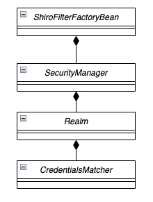
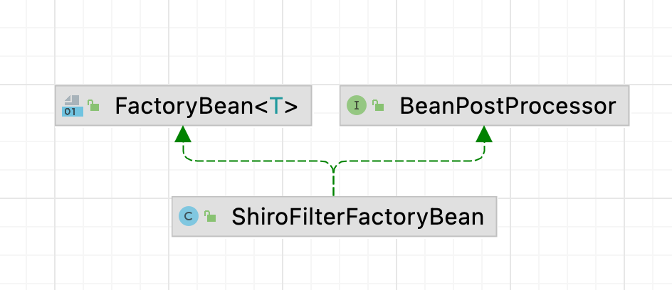
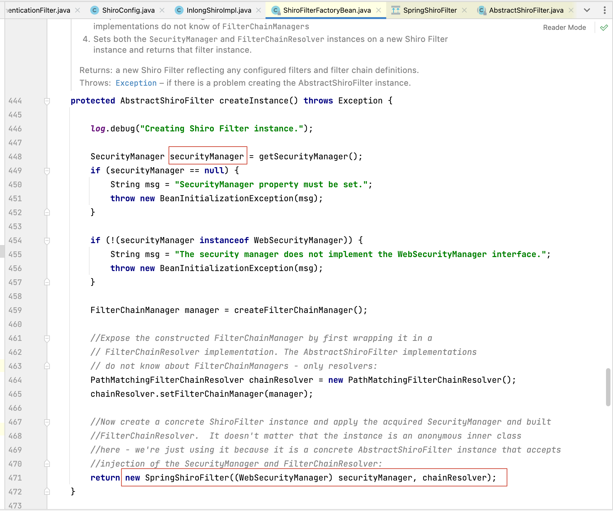
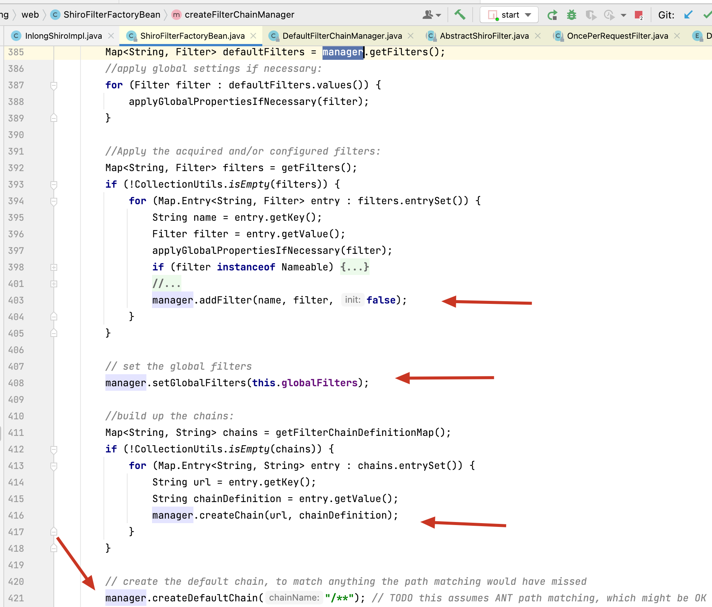
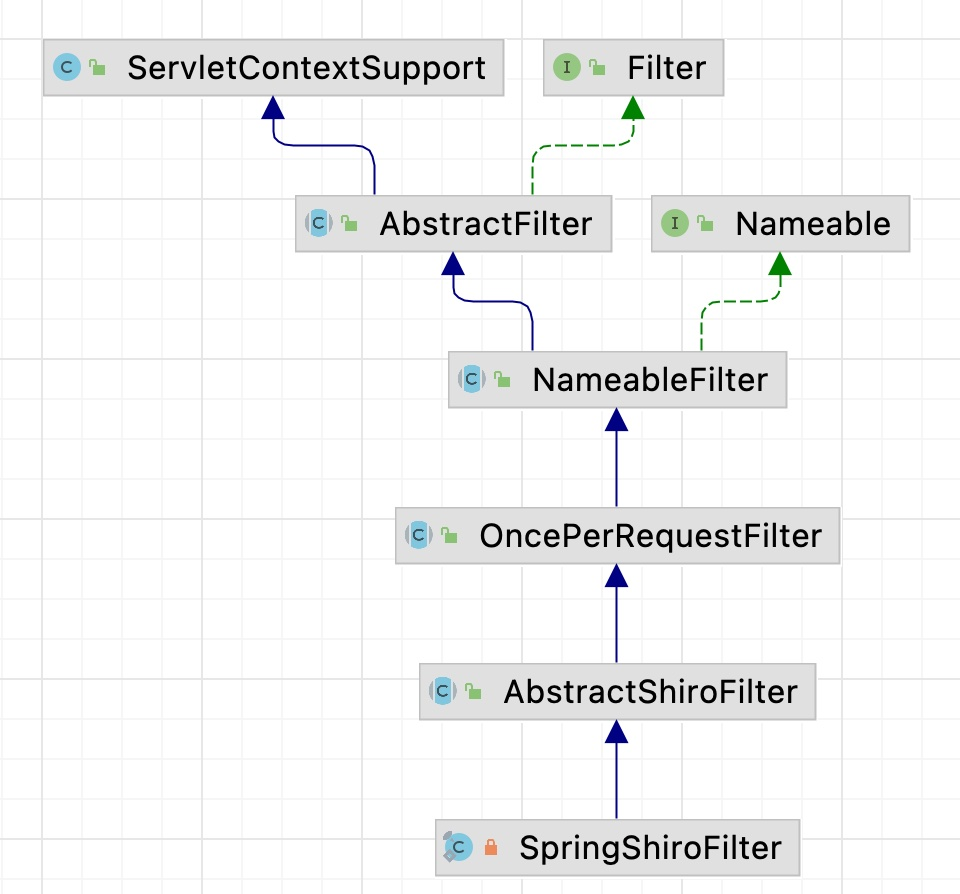
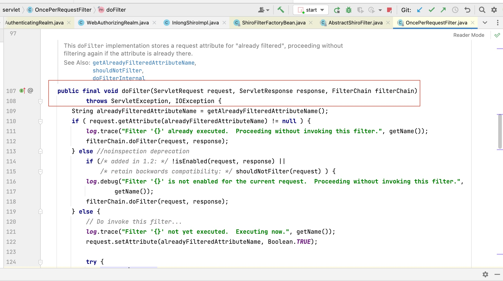

# Apache Shiro源码阅读

最近在腾讯实习参与开发Apache-InLong开源项目，其中负责的模块使用到了apache-shiro对访问权限进行控制，因此顺便把Apache-Shiro部分源码进行阅读。  

## 1. Authorization(授权，接口访问控制) 和 Authentication(认证，登陆)基础
Apache-Shiro中对接口访问控制最常用的两种配置是：`anno`和`authc`, 其中每种配置都代表一个过滤器，接口如果配置`authc`表示当前接口需要登录才能访问, `anno`表示无需什么特殊权限就能够访问. Spring-Boot中具体如何整合Apache-shiro进行权限控制的这里就不在赘述, 我们从入口处看起:  

```java
    @Bean
    public ShiroFilterFactoryBean shiroFilter(SecurityManager securityManager) {
        return inLongShiro.getShiroFilter(securityManager);
    }
```  

默认情况下`authc`对应的过滤器是: `org.apache.shiro.web.filter.authc.FormAuthenticationFilter`, 点进入源码中会发现这个过滤器的实现类继承了一大堆东西, 一层又一层的, 非常复杂, 但是我们最终的目的就是实现一个`Filter`接口就行了,  
在Apache-Inlong开源项目中我们就自定义了`authc`的过滤器`AuthenticationFilter.class`

```java
    @Override
    public ShiroFilterFactoryBean getShiroFilter(SecurityManager securityManager) {
        ShiroFilterFactoryBean shiroFilterFactoryBean = new ShiroFilterFactoryBean();
        shiroFilterFactoryBean.setSecurityManager(securityManager);
        // anon: can be accessed by anyone, authc: only authentication is successful can be accessed
        Map<String, Filter> filters = new LinkedHashMap<>();
        filters.put("authc", new AuthenticationFilter());
        shiroFilterFactoryBean.setFilters(filters);
        Map<String, String> pathDefinitions = new LinkedHashMap<>();
        // login, register request
        pathDefinitions.put("/anno/**/*", "anon");

        // swagger api
        pathDefinitions.put("/doc.html", "anon");
        pathDefinitions.put("/v2/api-docs/**/**", "anon");
        pathDefinitions.put("/webjars/**/*", "anon");
        pathDefinitions.put("/swagger-resources/**/*", "anon");
        pathDefinitions.put("/swagger-resources", "anon");

        // openapi
        pathDefinitions.put("/openapi/**/*", "anon");
        pathDefinitions.put("/**", "authc");
        shiroFilterFactoryBean.setFilterChainDefinitionMap(pathDefinitions);
        return shiroFilterFactoryBean;
    }

```

Apache-Shiro的生命周期从Spring的Configure类中通过注入`ShiroFilterFactoryBean`类开始, 其初始化需要依赖`CredentialsMatcher`, `SecurityManager` 以及自定义的 `AuthorizingRealm`等类信息, 类之间的聚合关系如下图所示:  
  
显然可见, ShiroFilterFactoryBean就是一个过滤器链, 里面具体怎么实现靠用户自定义的securityManager等相关类中的逻辑实现.  


## 2. 深度剖析ShiroFilterFactoryBean  

先看一下其实现的接口:  

  

看到第一个接口`FactoryBean`相信阅读多Spring源码的童鞋都不会太陌生, 这个时候第一想到的就是看看`ShiroFilterFactoryBean`中的`getObject()`方法. 
> (不熟悉FactoryBean接口的童鞋参考下我的另一篇文章:[关于FactoryBean的那些事](./spring/factorybean.md)) 

在`getObject`方法中会调用`createInstance()`来初始化一个`AbstractShiroFilter`实例, 具体的实现类是`SpringShiroFilter`, 并且将我们自定义的`SecurityManager`作为参数传递到`SpringShrioFilter`实例中.  
  
在上图代码的459行: `createFilterChainManager()`方法中会初始化DefaultFilterChainManager类, 这个类的构造方法最后一行`createDefaultFilters(false)`中便能够发现Apache-shiro框架中各个默认的过滤器:  

```java
class DefaultFilterChainManager{}
    protected void addDefaultFilters(boolean init) {
        for (DefaultFilter defaultFilter : DefaultFilter.values()) {
            addFilter(defaultFilter.name(), defaultFilter.newInstance(), init, false);
        }
    }
    ...
}

public enum DefaultFilter {
    anon(AnonymousFilter.class),
    authc(FormAuthenticationFilter.class),
    authcBasic(BasicHttpAuthenticationFilter.class),
    authcBearer(BearerHttpAuthenticationFilter.class),
    logout(LogoutFilter.class),
    noSessionCreation(NoSessionCreationFilter.class),
    perms(PermissionsAuthorizationFilter.class),
    port(PortFilter.class),
    rest(HttpMethodPermissionFilter.class),
    roles(RolesAuthorizationFilter.class),
    ssl(SslFilter.class),
    user(UserFilter.class),
    invalidRequest(InvalidRequestFilter.class);
}
```

以及如何加载我们用户自定义的过滤器:  

   

初始化完成全部过滤器之后`ShiroFilterFactoryBean` 这个 **Bean** 最终返回的是一个SpringShiroFilter过滤器对象, 因此毫无疑问, 直接找这个类中的`doFilter()`方法, 看下其具体调用执行逻辑(当然你也可以直接使用IDEA工具打断点, 然后访问某个被过滤器拦截的URL, 这样跟着程序跑一下理解的会更加深刻).  

看一下`SpringShiroFilter`类结构:  

  

由于`SpringShiroFilter`中只有一个构造方法, 因此直接往上面继承的类中找`doFilter()`实现方法, 最终在父类`OncePerRequestFilter`类中看到了`doFilter()`的实现:  

  

到此为止Apache-Shiro整个过滤器链路相信基本上彻底清楚了.  